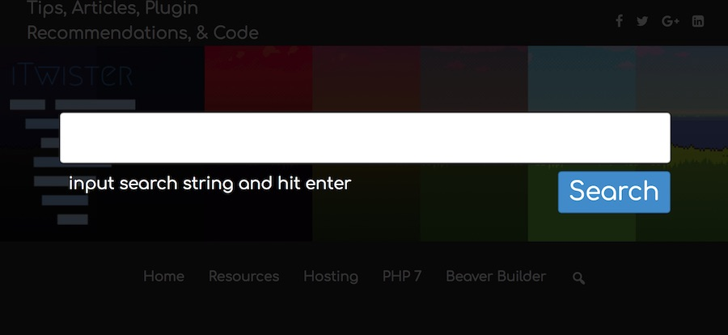

# TW-Search Read Me

Plugin to add a search overlay. By default, this doesn't work out of the box. You either need to add the custom class or change the settings in the customizer.

## To Use
1. Install
1. Activate
1. Look in the customizer for settings.

## Custom Class
You can choose to add a custom class `js-twSearch`. This can be added to anything you want to open the search.

## ToDo

1. Write a readme
1. Document More
1. Screenshots
1. Make Better
1. Test

## Release Notes
- 0.4 - Refactored for namespacing and OOP.
  - Adds namespacing
  - Refactored for OOP
  - Requires PHP > 7.1

- 0.3 - Added ability to hit escape key and close the search overlay.

- 0.2.1 and earlier - Initial release. 
